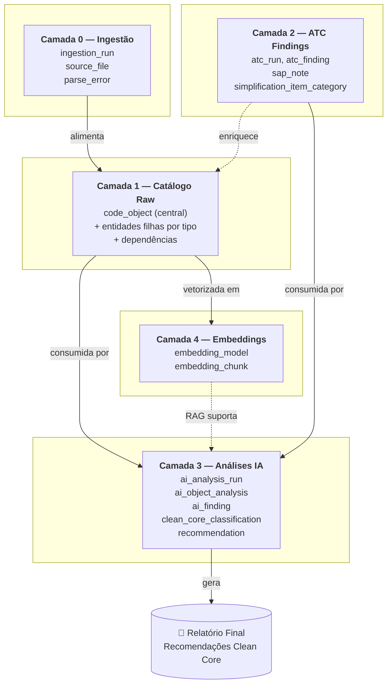

# Modelagem Conceitual — Banco de Dados de Análise SAP Clean Core

> **R3.2 ATC compatibility note (2026-09-24):** this is historical/analytical material. Any fixed counts, column lists, pre-seeded ATC checks, packages or values described below reflect a reviewed sample and are **not** the runtime XLSX contract. Canonical ATC ingestion is schema-tolerant and defined by `docs/data/atc-import-contract.md` and ADR-016.

> **HISTORICAL ANALYTICAL DOCUMENT:** Preserved as prior analysis/reference. It is not the current runtime/domain/UX source of truth. Baseline R3.2, accepted ADRs, and current `docs/data`, `docs/product`, `docs/ux`, `docs/design`, and `docs/delivery` documents prevail on conflicts.

**Projeto:** Copa Energia — Migração SAP ECC → S/4HANA
**Cliente:** Copa Energia | **Executor:** T-Systems do Brasil
**Documento:** Entrega 1 — Modelagem conceitual (pré-DDL)
**Versão:** 1.0
**Data:** Abril 2026

---

## Sumário Executivo

Este documento define a estrutura conceitual do banco de dados SQLite que sustentará toda a análise de código customizado SAP no projeto. O modelo é organizado em **quatro camadas com responsabilidades distintas**, projetadas para suportar três cargas de trabalho fundamentais:

1. **Ingestão** dos arquivos exportados do SAP (HTML/TXT) sem perda de informação
2. **Análise por agentes de IA** com versionamento e rastreabilidade
3. **Geração do relatório final** consolidando recomendações Clean Core

A entidade central é `code_object`, que unifica todos os tipos de objeto SAP (PROG, FUGR, FUNC, CLAS, TABL, etc.) sob um único discriminator. As demais entidades orbitam em torno dela: estruturas filhas para detalhes específicos por tipo, dependências para o grafo de relacionamentos, findings ATC como fonte oficial de problemas conhecidos, análises de IA como camada interpretativa, e embeddings para alimentar consultas RAG dos agentes.

---

## Índice

1. [Princípios de Design](#1-princípios-de-design)
2. [Visão em Camadas](#2-visão-em-camadas)
3. [Camada 1 — Catálogo de Objetos SAP (Raw)](#3-camada-1--catálogo-de-objetos-sap-raw)
4. [Camada 2 — Findings Externos (ATC)](#4-camada-2--findings-externos-atc)
5. [Camada 3 — Análises de IA](#5-camada-3--análises-de-ia)
6. [Camada 4 — Embeddings (RAG)](#6-camada-4--embeddings-rag)
7. [Camada 0 — Metadados de Ingestão](#7-camada-0--metadados-de-ingestão)
8. [Diagrama ER Consolidado](#8-diagrama-er-consolidado)
9. [Rastreabilidade — Schema vs. Perguntas do Relatório Final](#9-rastreabilidade--schema-vs-perguntas-do-relatório-final)
10. [Limitações Conhecidas](#10-limitações-conhecidas)
11. [Próximos Passos](#11-próximos-passos)

---

## 1. Princípios de Design

### 1.1 Dedup nominativo (single source of truth)

Cada objeto SAP tem **um único registro** no banco, identificado pela chave composta `(object_name, object_type)`. Isso é fundamental porque a exportação fornecida pelo cliente apresenta o mesmo objeto em múltiplos lugares — por exemplo, a tabela `ZTBCAI_DOC_A` aparece tanto em `dictionary_table_type/` (raiz) quanto em `Programas_e_classes/<programa>/dictionary/` (uso por programa). Evitar duplicação é crítico para que consultas analíticas tenham respostas corretas (ex.: "quantas tabelas Z existem?" deve retornar o número real, não inflado por replicação).

A rastreabilidade da origem física é preservada através da entidade `source_file`, que mantém a lista de arquivos onde cada objeto foi encontrado.

### 1.2 Discriminator pattern para tipos de objeto

Em vez de criar 20+ tabelas (uma por tipo de objeto SAP), usamos uma **tabela central `code_object`** com a coluna `object_type` discriminando o tipo, e tabelas filhas opcionais apenas para tipos que têm campos específicos relevantes (campos de tabela, parâmetros de função, métodos de classe). Isso evita explosão de joins, simplifica queries dos agentes IA ("todos os objetos do pacote X" vira uma query única), e mantém o modelo extensível para tipos novos sem refatoração.

### 1.3 Camadas separadas para fonte / análise / interpretação

O modelo separa rigorosamente:

- **Dados objetivos** vindos do SAP (camada raw) — imutáveis após ingestão
- **Findings oficiais** do ATC (camada externa) — fonte autoritativa SAP
- **Interpretações da IA** (camada analítica) — reprocessáveis sem afetar as anteriores
- **Vetores para RAG** (camada de embeddings) — reconstruíveis a partir das outras

Essa separação permite reprocessar análises de IA quantas vezes for necessário (testando prompts, modelos, abordagens) sem nunca perder ou contaminar os dados-fonte.

### 1.4 Versionamento de análises IA

Todas as análises de IA são vinculadas a um `ai_analysis_run` que registra modelo usado, prompt, data e parâmetros. Isso permite manter histórico de execuções, comparar resultados entre prompts/modelos, e rastrear qual análise originou cada recomendação no relatório final. O custo em SQLite é desprezível.

### 1.5 Parametrização do modelo de embedding

A tabela de embeddings registra explicitamente o modelo usado e a dimensão do vetor. O default é **`bge-m3` local com 1024 dimensões**, mas o schema permite trocar de modelo no futuro (inclusive coexistir múltiplos modelos) sem migração.

### 1.6 Rastreabilidade ponta-a-ponta

Toda recomendação do relatório final precisa ser rastreável até suas fontes:
**recomendação → análise IA → finding ATC + análise estrutural → objeto SAP → arquivo físico de origem**. Esse princípio guia o desenho dos relacionamentos entre as camadas.

---

## 2. Visão em Camadas

**Sentido do fluxo:**

- **Camada 0** lê os arquivos físicos e popula a Camada 1 (relação determinística, uma vez por arquivo)
- **Camada 1** é o catálogo objetivo do ambiente SAP — não muda após ingestão
- **Camada 2** pode conter múltiplos `atc_run`s por Assessment; cada XLSX é descoberto/mapeado dinamicamente e cruzado com a Camada 1 quando os identificadores disponíveis permitem
- **Camada 3** consome as Camadas 1 e 2, com auxílio da Camada 4 (RAG), e produz interpretações versionadas
- **Camada 4** é construída a partir da Camada 1 e usada como contexto nas execuções de IA
- O **relatório final** é a materialização final, agregando recomendações da Camada 3 com evidências das Camadas 1 e 2

---

## 3. Camada 1 — Catálogo de Objetos SAP (Raw)

### 3.1 Entidade central: `code_object`

Representa qualquer objeto SAP — programa, função, classe, tabela, estrutura, mensagem, etc.

| Atributo | Descrição |
|---|---|
| `id` (PK) | Identificador interno |
| `object_name` | Nome técnico SAP (ex.: `SAPMZ_CAI_CADEIA_TRANSF`, `ZCL_EXCEL`) |
| `object_type` | Discriminator: PROG, FUGR, FUNC, CLAS, INCL, TABL, STRU, TTYP, MSAG, DYNP, DOMA, DTEL, INTF, VIEW, TRANSF, ENHO |
| `description` | Descrição livre do objeto (de `<h3>` no HTML) |
| `package_id` (FK) | Pacote (DEVCLASS) — obtido do ATC |
| `namespace` | `Z`, `Y` ou `standard` (derivado do nome) |
| `is_custom` | True se Z/Y, False se SAP standard |
| `raw_code` | Código fonte completo em ABAP (UTF-8, sem markup HTML) |
| `raw_code_lines` | Contagem de linhas efetivas (excluindo comentários e linhas vazias) |
| `is_empty_implementation` | True se objeto tem corpo vazio (relevante para field exits "esqueleto") |
| `primary_source_file_id` (FK) | Arquivo principal de origem |
| `created_at`, `updated_at` | Timestamps |

**Constraint:** UNIQUE(`object_name`, `object_type`)

### 3.2 Metadados extraídos do header

Cabeçalhos SAP (padrão `*$*$`) trazem informações ricas que viram entidades próprias.

**`object_header_metadata`** (1:1 com `code_object`)

| Atributo | Descrição |
|---|---|
| `code_object_id` (FK, PK) | |
| `author_original` | Autor original (campo "Autor" / "Autores") |
| `analyst` | Analista responsável |
| `creation_date` | Data de criação informada no cabeçalho |
| `project` | Projeto vinculado (ex.: "ANEXO - Versao 2.0") |
| `system_module` | Sistema funcional (ex.: "ANEXO - Controle Apuração ICMS") |
| `purpose` | Finalidade declarada (texto livre) |
| `observations` | Observações livres |

**`modification_history`** (1:N com `code_object`)

| Atributo | Descrição |
|---|---|
| `id` (PK) | |
| `code_object_id` (FK) | |
| `modification_date` | Data da modificação |
| `author` | Autor da modificação |
| `rdm_number` | Número do RDM (Request for Modification) |
| `description` | Descrição da modificação |
| `sequence_order` | Ordem cronológica |

A frequência de modificações é um proxy importante de **criticidade do código** (código muito modificado tende a ser ativo; código sem modificações há anos pode ser candidato a descontinuar).

### 3.3 Estruturas de dados

**`table_field`** (1:N com `code_object` quando `object_type ∈ {TABL, STRU, TTYP}`)

| Atributo | Descrição |
|---|---|
| `id` (PK) | |
| `code_object_id` (FK) | Tabela/estrutura mãe |
| `field_name` | Nome do campo |
| `field_position` | Posição na tabela |
| `is_key` | True se é campo-chave |
| `data_element_id` (FK, opcional) | Referência para `data_element` |
| `domain_id` (FK, opcional) | Referência direta para `domain` (quando data element é vazio) |
| `data_type` | CHAR, NUMC, INT2, CLNT, CURR, DEC, STRG, TTYP, etc. |
| `length` | Comprimento |
| `lowercase_allowed` | Flag |
| `domain_text` | Texto descritivo do domínio (extraído inline) |

**`data_element`** (entidade própria, referenciada por `code_object` com `object_type='DTEL'`)

Data elements são reaproveitados entre múltiplas tabelas — entidade de primeira classe.

**`domain`** (entidade própria)

| Atributo | Descrição |
|---|---|
| `id` (PK) | |
| `domain_name` (UNIQUE) | Ex.: ZDOMM_CATEGORIA |
| `data_type` | CHAR, FLAG, etc. |
| `length` | |

**`domain_value`** (1:N com `domain`) — valores fixos de domínios

| Atributo | Descrição |
|---|---|
| `id` (PK) | |
| `domain_id` (FK) | |
| `value_low` | Ex.: '01' |
| `value_high` | (para faixas, geralmente vazio) |
| `text` | Ex.: "CAPEX" |

### 3.4 Function modules e function groups

**`function_group`** (FK 1:1 com `code_object` quando `object_type='FUGR'`)

| Atributo | Descrição |
|---|---|
| `code_object_id` (FK, PK) | |
| `top_include_name` | Ex.: `LZSDGF_VK12TOP` (extraído do arquivo `global-*`) |
| `function_pool_name` | Ex.: `ZSDGF_VK12` (extraído do `FUNCTION-POOL` statement) |

**`function_module`** (FK 1:1 com `code_object` quando `object_type='FUNC'`)

| Atributo | Descrição |
|---|---|
| `code_object_id` (FK, PK) | |
| `function_group_id` (FK) | Function group ao qual pertence |

**`function_parameter`** (1:N com `function_module`)

| Atributo | Descrição |
|---|---|
| `id` (PK) | |
| `function_module_id` (FK) | |
| `parameter_kind` | IMPORTING / EXPORTING / CHANGING / TABLES |
| `parameter_name` | Ex.: INPUT, OUTPUT |
| `pass_mode` | REFERENCE / VALUE |
| `type_specification` | Tipo declarado |
| `is_optional` | |
| `default_value` | |

**`function_exception`** (1:N) — exceções declaradas pela função

### 3.5 Classes globais

**`class_attribute`** (1:N com `code_object` quando type='CLAS')

| Atributo | Descrição |
|---|---|
| `id` (PK) | |
| `code_object_id` (FK) | Classe mãe |
| `visibility` | PUBLIC / PRIVATE / PROTECTED |
| `attribute_name` | |
| `is_constant` | |
| `is_readonly` | |
| `type_specification` | Tipo (TYPE REF TO X, TYPE Y, etc.) |
| `default_value` | |

**`class_method`** (1:N com `code_object` quando type='CLAS')

| Atributo | Descrição |
|---|---|
| `id` (PK) | |
| `code_object_id` (FK) | Classe mãe |
| `method_name` | |
| `visibility` | PUBLIC / PRIVATE / PROTECTED |
| `description` | Texto descritivo do método |
| `method_code` | Código ABAP do método |
| `source_file_id` (FK) | Arquivo HTML do método |
| `is_constructor` | |
| `is_static` | |

**`method_parameter`** (1:N) — análogo a `function_parameter`

**`method_exception`** (1:N) — `RAISING ZCX_*`

**`interface_implementation`** (N:N entre `code_object` classe e `code_object` interface)

Importante: as interfaces (ZIF_*) frequentemente **não estão exportadas**. Nesses casos, criamos um `code_object` placeholder com `object_type='INTF'` e flag `is_resolved=false` (definida na entidade `external_reference` — ver 3.7).

### 3.6 Telas (Dynpros) e GUI

**`screen`** (1:1 com `code_object` quando type='DYNP')

| Atributo | Descrição |
|---|---|
| `code_object_id` (FK, PK) | |
| `parent_program_id` (FK → code_object) | Programa que contém a tela |
| `screen_number` | Ex.: 1000 |
| `screen_type` | Normal / Modal / Subscreen |
| `flow_logic_pbo` | Código PROCESS BEFORE OUTPUT |
| `flow_logic_pai` | Código PROCESS AFTER INPUT |

**`screen_field`** (1:N) — campos da tela com posicionamento e tipo

**`gui_title`** (1:1 com `code_object` quando type='GUIT')

### 3.7 Mensagens

**`message`** (1:N com `code_object` quando type='MSAG')

| Atributo | Descrição |
|---|---|
| `id` (PK) | |
| `code_object_id` (FK) | Message class mãe |
| `message_number` | 000-999 |
| `message_text` | Texto da mensagem |
| `has_placeholders` | True se contém `&` ou `&N` |
| `placeholder_style` | LEGACY (`&`) ou MODERN (`&1 &2`) |

**Constraint:** UNIQUE(`code_object_id`, `message_number`)

### 3.8 Dependências e referências

**`object_dependency`** — relação genérica entre objetos

| Atributo | Descrição |
|---|---|
| `id` (PK) | |
| `source_object_id` (FK → code_object) | Objeto que faz a referência |
| `target_object_id` (FK → code_object, opcional) | Objeto referenciado (NULL se não resolvido) |
| `target_object_name` | Nome textual do alvo (sempre preenchido) |
| `target_object_type` | Tipo esperado do alvo |
| `dependency_kind` | TABLE_USAGE, FUNCTION_CALL, METHOD_CALL, INCLUDE_USE, MESSAGE_USE, SUBMIT, SCREEN_CALL, INTERFACE_IMPL, INHERITANCE, TYPE_REF, VIEW_BASE |
| `is_resolved` | True se `target_object_id` foi encontrado |
| `source_location` | Linha do código onde foi detectada (opcional, preenchida por análise IA) |
| `detected_by` | PARSER (durante ingestão) ou AI (durante análise) |

Esta entidade é **central** para responder perguntas como:
- "Quais Z's tocam tabelas X?" → `WHERE dependency_kind='TABLE_USAGE' AND target_object_name='X'`
- "Quais funções nunca são chamadas?" → função sem registros em `target_object_id`
- "Mensagens órfãs?" → message_class sem `dependency_kind='MESSAGE_USE'`

### 3.9 Pacotes (DEVCLASS)

**`package`**

| Atributo | Descrição |
|---|---|
| `id` (PK) | |
| `package_name` (UNIQUE) | Ex.: ZSD, ZINCORPORACAO, ZNFE |
| `description` | Opcional |
| `is_custom` | True se Z/Y |

Pacotes podem vir do Excel ATC. O arquivo de referência apresentou 56 valores distintos, mas o catálogo é dinâmico e não possui cardinalidade fixa.

---

## 4. Camada 2 — Findings Externos (ATC)

### 4.1 Execução do ATC

**`atc_run`**

| Atributo | Descrição |
|---|---|
| `id` (PK) | |
| `executed_at` | Data da execução (27/04/2026 no caso atual) |
| `executed_by` | Ex.: T-SYSTEMS BASIS |
| `check_variant` | Ex.: S4HANA_READINESS_2025_NO_FLE |
| `run_series` | Ex.: ERP_S4_Z_Y |
| `total_findings` | 7899 no caso atual |
| `total_errors`, `total_warnings`, `total_information` | Contadores |
| `source_file_id` (FK) | Arquivo Excel/DOCX origem |

Apesar de planejarmos uma única execução, manter como entidade permite múltiplos runs sem refatoração.

### 4.2 Catálogo de checks

**`atc_check`**

| Atributo | Descrição |
|---|---|
| `id` (PK) | |
| `check_title` (UNIQUE) | Ex.: "S/4HANA: Search for Usages of Simplified Objects" |
| `check_class_name` | Ex.: CL_CI_TEST_SEARCH_ABAP_PATTERN (quando informado) |
| `description` | |

### 4.3 Findings individuais

**`atc_finding`**

| Atributo | Descrição |
|---|---|
| `id` (PK) | |
| `atc_run_id` (FK) | |
| `code_object_id` (FK → code_object, opcional) | Objeto analisado (pode ser NULL se for objeto SAP standard) |
| `object_name_raw` | Nome cru do objeto (sempre preenchido) |
| `object_type_raw` | Tipo cru |
| `atc_check_id` (FK) | |
| `check_message` | Ex.: "Use of Database Hint: ..." |
| `priority` | 1=Error, 2=Warning, 3=Information |
| `location_line` | Linha do código onde foi detectado |
| `description_text` | Descrição completa do finding |
| `sap_note_id` (FK, opcional) | SAP Note recomendada |
| `referenced_app_component` | Ex.: SD-BF-MIG, CA-FLE-AMT |
| `referenced_object_type` | TABL, FUNC, TRAN, DTEL, etc. |
| `referenced_object_name` | Nome do objeto SAP standard impactado |
| `simplification_item_category_id` (FK, opcional) | |
| `change_category` | A=Automatic, T=Technical, F=Functional |
| `change_description` | Texto descritivo |
| `contact_person`, `object_responsible`, `last_changed_by` | Pessoas |
| `first_found_on` | Data de primeira detecção |

O campo `referenced_object_name` é especialmente importante: liga o finding ao **objeto SAP standard que está causando o problema** (a tabela simplificada, a função obsoleta, a TCODE removida). É o que permite responder "todas as nossas customizações que tocam tabelas afetadas pela simplificação SD".

### 4.4 SAP Notes

**`sap_note`**

| Atributo | Descrição |
|---|---|
| `id` (PK) | |
| `note_number` (UNIQUE) | Ex.: '2610650' |
| `short_text` | Ex.: "Amount Field Length Extension: Code Adaptations" |
| `application_component` | |
| `note_url` | https://launchpad.support.sap.com/#/notes/{number} |
| `note_content` | Texto completo (quando recuperável — opcional) |

O relatório de referência apresentou 56 SAP Notes distintas após desconsiderar o valor sentinela observado. A cardinalidade é dinâmica por run; notas válidas servem como contexto autoritativo para recomendações.

### 4.5 Catálogos auxiliares

**`simplification_item_category`** — catálogo de categorias B/A/C/I/S/W com descrições.

---

## 5. Camada 3 — Análises de IA

### 5.1 Execução de análise

**`ai_analysis_run`**

| Atributo | Descrição |
|---|---|
| `id` (PK) | |
| `started_at`, `completed_at` | |
| `analysis_type` | OBJECTIVE_EXTRACTION, FINDING_DETECTION, CLEAN_CORE_CLASSIFICATION, RECOMMENDATION_GENERATION |
| `model_provider` | anthropic, openai, local, etc. |
| `model_name` | Ex.: claude-opus-4-7 |
| `prompt_template_id` | Identificador do prompt usado |
| `prompt_template_text` | Snapshot do prompt (para reproducibility) |
| `total_objects_processed` | |
| `notes` | |

Manter snapshot do prompt é crítico — permite reproduzir resultados e comparar variações.

### 5.2 Análise por objeto

**`ai_object_analysis`**

| Atributo | Descrição |
|---|---|
| `id` (PK) | |
| `code_object_id` (FK) | Objeto analisado |
| `ai_analysis_run_id` (FK) | Execução |
| `functional_objective` | Texto livre — "o que esse programa faz em linguagem de negócio" |
| `business_domain_inferred` | Ex.: "Faturamento", "Gestão de Frotas" |
| `complexity_assessment` | LOW / MEDIUM / HIGH / VERY_HIGH |
| `criticality_inferred` | LOW / MEDIUM / HIGH (baseado em uso, modificações, dependências) |
| `is_oss_library_detected` | Flag para bibliotecas open-source (abap2xlsx, abapGit, etc.) |
| `oss_library_name` | Quando detectada |
| `confidence_score` | 0.0-1.0 — autoavaliação do agente |
| `analysis_notes` | Observações livres da IA |

### 5.3 Findings detectados pela IA

**`ai_finding`** — anti-patterns, code smells, oportunidades de modernização

| Atributo | Descrição |
|---|---|
| `id` (PK) | |
| `code_object_id` (FK) | |
| `ai_analysis_run_id` (FK) | |
| `finding_type` | HARDCODED_MESSAGE, OBSOLETE_FIELD_EXIT, EMPTY_IMPLEMENTATION, NATIVE_SQL, MAGIC_NUMBER, NO_ERROR_HANDLING, etc. |
| `severity` | LOW / MEDIUM / HIGH / CRITICAL |
| `description` | Texto explicando o problema |
| `code_excerpt` | Trecho de código relevante |
| `location_hint` | Linha aproximada ou contexto |
| `remediation_hint` | Sugestão da IA para corrigir |

A categoria `finding_type` deve ter um **catálogo controlado** (lista enum), distinto da categoria livre `description`. Isso permite agregação confiável no relatório ("80 programas com hard-coded messages").

### 5.4 Classificação Clean Core

**`clean_core_classification`** (1:N por objeto — múltiplos runs podem reclassificar)

| Atributo | Descrição |
|---|---|
| `id` (PK) | |
| `code_object_id` (FK) | |
| `ai_analysis_run_id` (FK) | |
| `classification` | DESCONTINUAR, REMEDIAR, MODERNIZAR, SUBSTITUIR_STANDARD, REIMPLEMENTAR_EXTENSAO, ATUALIZAR_OSS, MANTER_AS_IS |
| `justification` | Texto livre justificando a classificação |
| `effort_estimate` | LOW / MEDIUM / HIGH |
| `risk_assessment` | LOW / MEDIUM / HIGH |
| `priority` | 1-5 (priorização para roadmap) |
| `is_final` | Flag para marcar a classificação considerada final no relatório |

A categoria `ATUALIZAR_OSS` é específica para bibliotecas open-source detectadas (insight identificado durante análise dos exemplos — abap2xlsx é OSS pública, não desenvolvimento Copa Energia).

### 5.5 Recomendações

**`recommendation`** (1:N) — recomendações textuais consolidadas para o relatório

| Atributo | Descrição |
|---|---|
| `id` (PK) | |
| `code_object_id` (FK) | |
| `clean_core_classification_id` (FK) | Classificação que originou a recomendação |
| `ai_analysis_run_id` (FK) | |
| `title` | Título curto |
| `description` | Recomendação completa |
| `target_state` | Estado-alvo descrito (ex.: "Substituir por API I_SalesOrder do S/4HANA") |
| `referenced_sap_notes` | Lista de SAP Notes consultadas (JSON ou tabela ponte) |

---

## 6. Camada 4 — Embeddings (RAG)

### 6.1 Catálogo de modelos

**`embedding_model`**

| Atributo | Descrição |
|---|---|
| `id` (PK) | |
| `model_name` (UNIQUE) | Ex.: bge-m3, voyage-code-3 |
| `dimension` | Ex.: 1024 |
| `provider` | local, voyage, openai, anthropic |
| `description` | |

Permite múltiplos modelos coexistirem no mesmo banco se necessário.

### 6.2 Chunks vetorizados

**`embedding_chunk`**

| Atributo | Descrição |
|---|---|
| `id` (PK) | |
| `code_object_id` (FK) | Objeto vetorizado |
| `embedding_model_id` (FK) | |
| `chunk_kind` | RAW_CODE, FUNCTIONAL_OBJECTIVE, METHOD_BODY, TABLE_DESCRIPTION, MESSAGE_CLASS_AGGREGATE |
| `chunk_index` | Quando o objeto é dividido em múltiplos chunks |
| `chunk_text` | Texto fonte do embedding (para auditoria) |
| `chunk_text_hash` | SHA-256 — permite detectar se já foi vetorizado |
| `created_at` | |

**`embedding_vector`** (tabela específica usando `sqlite-vec`)

A extensão `sqlite-vec` armazena os vetores eficientemente e suporta busca por similaridade (cosine, L2). Tabela com schema específico da extensão referenciando `embedding_chunk.id`.

### 6.3 Estratégia de chunking

Múltiplas estratégias coexistem na mesma tabela, discriminadas por `chunk_kind`:

- **RAW_CODE**: código fonte completo do objeto (para objetos pequenos) ou dividido em N chunks com overlap (para programas grandes)
- **FUNCTIONAL_OBJECTIVE**: o texto da finalidade extraído por IA (semântico, em português)
- **METHOD_BODY**: corpo de métodos individuais de classes (granularidade fina)
- **TABLE_DESCRIPTION**: estrutura serializada de tabela (campos + descrições)
- **MESSAGE_CLASS_AGGREGATE**: todas as mensagens de uma message class concatenadas (insight identificado em discussão prévia — mensagens isoladas têm pouco sinal semântico)

Essa flexibilidade permite consultas RAG diferenciadas: "encontrar programas com objetivo similar" usa FUNCTIONAL_OBJECTIVE; "encontrar trechos de código parecidos com este" usa RAW_CODE; "encontrar tabelas que armazenam dados similares" usa TABLE_DESCRIPTION.

---

## 7. Camada 0 — Metadados de Ingestão

Camada operacional, suporta auditoria e troubleshooting.

**`ingestion_run`**

| Atributo | Descrição |
|---|---|
| `id` (PK) | |
| `started_at`, `completed_at` | |
| `source_root_path` | Diretório raiz da exportação |
| `total_files_processed` | |
| `total_files_failed` | |
| `total_objects_created` | |
| `total_objects_updated` | |
| `notes` | |

**`source_file`**

| Atributo | Descrição |
|---|---|
| `id` (PK) | |
| `ingestion_run_id` (FK) | |
| `relative_path` | Caminho a partir da raiz |
| `file_format` | HTML / TXT / XLSX / DOCX |
| `category` | dictionary_table_struc, dictionary_table_type, funcoes, mensagens, objetos, programas_e_classes, atc_report |
| `size_bytes` | |
| `content_hash` | SHA-256 — detecta arquivos idênticos em locais diferentes |
| `code_object_id` (FK, opcional) | Objeto que este arquivo populou |
| `parse_status` | SUCCESS, PARTIAL, FAILED, SKIPPED |
| `read_at` | |

A relação é N:1 com `code_object`: um objeto pode ter sido populado por múltiplos arquivos (ex.: tabela que apareceu em dois lugares; classe com 36 arquivos de método). O campo `content_hash` permite detectar formalmente quando dois arquivos físicos têm o mesmo conteúdo.

**`parse_error`** — erros e avisos durante o parsing, para revisão posterior

---

## 8. Diagrama ER Consolidado

```mermaid
erDiagram
    code_object ||--o| object_header_metadata : "tem"
    code_object ||--o{ modification_history : "tem"
    code_object ||--o{ table_field : "(se TABL/STRU)"
    code_object ||--o{ class_attribute : "(se CLAS)"
    code_object ||--o{ class_method : "(se CLAS)"
    code_object ||--o{ message : "(se MSAG)"
    code_object ||--o| function_module : "(se FUNC)"
    code_object ||--o| function_group : "(se FUGR)"
    code_object ||--o| screen : "(se DYNP)"
    code_object }o--o| package : "pertence a"
    code_object ||--o{ source_file : "veio de"

    function_module ||--o{ function_parameter : "tem"
    function_module ||--o{ function_exception : "declara"
    function_module }o--|| function_group : "pertence a"

    class_method ||--o{ method_parameter : "tem"
    class_method ||--o{ method_exception : "declara"

    table_field }o--o| data_element : "tipado por"
    table_field }o--o| domain : "ou domínio direto"
    domain ||--o{ domain_value : "tem valores"

    code_object ||--o{ object_dependency : "fonte de"
    code_object ||--o{ object_dependency : "alvo de"

    code_object ||--o{ atc_finding : "tem findings"
    atc_finding }o--|| atc_run : "de execução"
    atc_finding }o--|| atc_check : "do check"
    atc_finding }o--o| sap_note : "recomenda"
    atc_finding }o--o| simplification_item_category : "categoria"

    code_object ||--o{ ai_object_analysis : "analisado por"
    code_object ||--o{ ai_finding : "tem findings IA"
    code_object ||--o{ clean_core_classification : "classificado como"
    code_object ||--o{ recommendation : "tem recomendação"
    code_object ||--o{ embedding_chunk : "vetorizado em"

    ai_object_analysis }o--|| ai_analysis_run : "de execução"
    ai_finding }o--|| ai_analysis_run : "de execução"
    clean_core_classification }o--|| ai_analysis_run : "de execução"
    recommendation }o--|| clean_core_classification : "baseada em"

    embedding_chunk }o--|| embedding_model : "usa modelo"

    source_file }o--|| ingestion_run : "de execução"
```

Note: o diagrama omite atributos para legibilidade. Entidades pouco centrais (parse_error, gui_title, screen_field) também foram omitidas para clareza visual mas existem no modelo.

---

## 9. Rastreabilidade — Schema vs. Perguntas do Relatório Final

O relatório final deve responder seis perguntas-chave. Tabela mapeando cada uma às entidades que sustentam a resposta.

| Pergunta | Entidades-fonte | Estratégia |
|---|---|---|
| **1. Quais programas ainda são usados?** | `code_object`, `object_dependency`, `atc_finding`, `modification_history` | Programa "usado" = referenciado por outros objetos (entradas em `object_dependency` como target) + modificações recentes em `modification_history`. Limitação: sem dados de execução em runtime (ST03N), uso real não pode ser confirmado — apenas inferido por chamadas estáticas. |
| **2. Quais acessam tabelas alteradas no S/4HANA?** | `atc_finding` (filtrar por check "S/4HANA: Search for Usages of Simplified Objects" ou similar), `object_dependency` (TABLE_USAGE) cruzado com `sap_note` | Resposta direta no ATC. 2.252 findings já mapeados no run atual. |
| **3. Quais têm problemas de performance?** | `atc_finding` (checks "Search problematic statements...", "Critical Statements"), `ai_finding` (findings IA específicos) | ATC já mapeou 2.999 findings de SELECT/OPEN CURSOR sem ORDER BY. Camada IA pode adicionar findings adicionais (loops aninhados, SELECTs em loops, etc.) |
| **4. Quais podem quebrar no upgrade?** | `atc_finding` com `priority=1` (Error) e `change_category='F'` (Functional) | ~2.139 findings são Error. Cruzar com `change_category='F'` filtra os de impacto funcional vs. técnico. |
| **5. Quais deveriam ser eliminados?** | `clean_core_classification` (`classification='DESCONTINUAR'`), `code_object.is_empty_implementation`, `object_dependency` (objetos sem dependências entrantes) | Análise IA combina três sinais: empty implementations, ausência de uso, ATC findings críticos sobre orphan objects (SAP Note 2296016). |
| **6. Quais para arquitetura mais limpa (Clean Core)?** | `clean_core_classification` (todas as categorias exceto MANTER_AS_IS) | A camada inteira de IA é dedicada a essa classificação. Cada objeto recebe categoria + justificativa + estimativa de esforço. |

---

## 10. Limitações Conhecidas

Documentadas explicitamente no schema para que o relatório final possa ser claro sobre o escopo da análise.

| # | Limitação | Impacto | Mitigação |
|---|---|---|---|
| 1 | Sem dados de execução em runtime (ST03N/SWNCMONI) | Não conseguimos confirmar uso real, apenas inferir por chamadas estáticas | Solicitar export futuramente; campos opcionais previstos no modelo (`code_object.usage_count`, `last_executed_at`) |
| 2 | TCODES não exportadas | Não temos mapeamento direto programa ↔ entrada do usuário | Solicitar export da TSTC; entidade `transaction` prevista mas vazia inicialmente |
| 3 | Smart Forms (SSFO), SAP Queries (AQQU/AQSG), Logical Databases (LDBA) ausentes na exportação | 64 objetos detectados pelo ATC sem código-fonte disponível | ATC findings continuam disponíveis para esses objetos (apenas metadados, sem `raw_code`) |
| 4 | Interfaces ZIF_* não exportadas | Implementações de interface aparecem como referências não resolvidas | `code_object` placeholder com `is_resolved=false`; nome preservado |
| 5 | Pacotes (DEVCLASS) só vêm do ATC | Objetos sem entrada no ATC não terão pacote identificado | Aceitar `package_id NULL`; relatório pode agrupar separadamente |
| 6 | Cabeçalhos de programa não padronizados | Nem todos os programas têm cabeçalho `*$*$` rico — alguns são esqueletos | `object_header_metadata` é opcional (1:0..1) |
| 7 | Encoding ISO-8859-1 com caracteres quebrados | Acentos podem aparecer mal em alguns arquivos | Conversão sistemática para UTF-8 na ingestão; campo `content_hash` mantém integridade do original |
| 8 | Bibliotecas OSS misturadas com código próprio | Sem distinção automática trivial | Camada IA detecta padrões OSS conhecidos (abap2xlsx, abapGit, ZSAPLINK) e marca via `is_oss_library_detected` |
| 9 | Pouquíssimo código namespace Y exportado | Apesar do ATC mencionar "Z_Y", apenas 2 objetos Y na exportação | Validar com cliente se há mais código Y a ser exportado |

---

## 11. Próximos Passos

Após aprovação desta modelagem conceitual, seguimos para:

1. **Entrega 2 — DDL SQLite executável**
   - CREATE TABLE para todas as entidades
   - Indexes em colunas de filtro frequente (object_name, object_type, package_id, dependency_kind, finding_type)
   - Configuração da extensão `sqlite-vec`
   - Constraints e foreign keys

2. **Entrega 3 — Modelos SQLAlchemy**
   - Classes Python com type hints
   - Relacionamentos bidirecionais
   - Métodos auxiliares para queries comuns
   - Mixin para soft delete (caso seja decidido posteriormente)

3. **Entrega 4 — Estratégia de Notebooks**
   - Sequência de notebooks Python para o pipeline de análise
   - Cada notebook tratando uma fase: ingestão → enriquecimento → análise IA → relatório

4. **Decisões pendentes (não bloqueantes para Entregas 2 e 3):**
   - Estrutura exata do prompt para extração do objetivo funcional
   - Estratégia de chunking para programas muito grandes (zcaiinc_frm_negocio_05.html tem 499KB)
   - Formato do relatório final (PDF? Excel? HTML interativo?)

---

**Fim da Entrega 1.**
